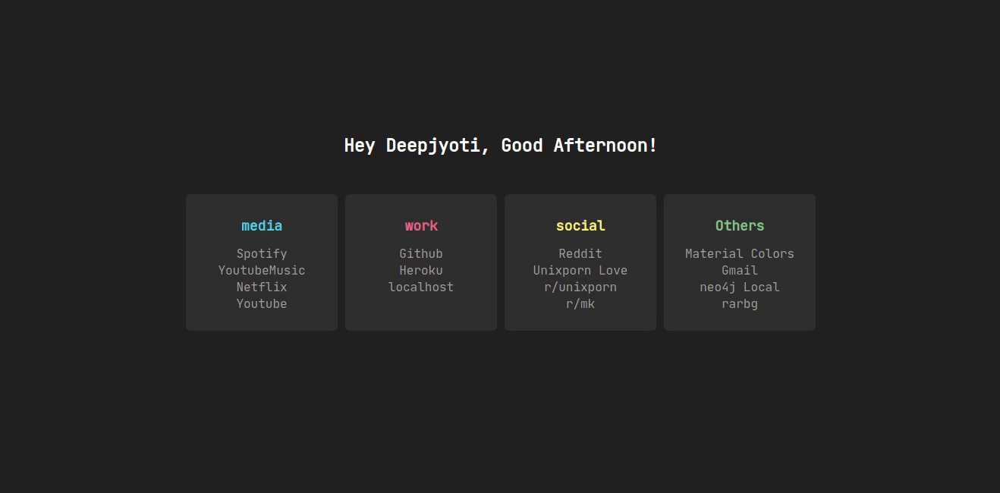

<h1>Minimal Startpage</h1>
<h4>Just another minimal startpage for browsers.</h4>

 

   
 

 
<h3>
<a href="https://github.com/deepjyoti30/startpage/wiki/Installation">Installation</a> | <a href="https://github.com/deepjyoti30/startpage/wiki/Configuration">Configuration</a> | <a href="https://github.com/deepjyoti30/startpage/wiki">Wiki</a>
</h3>

